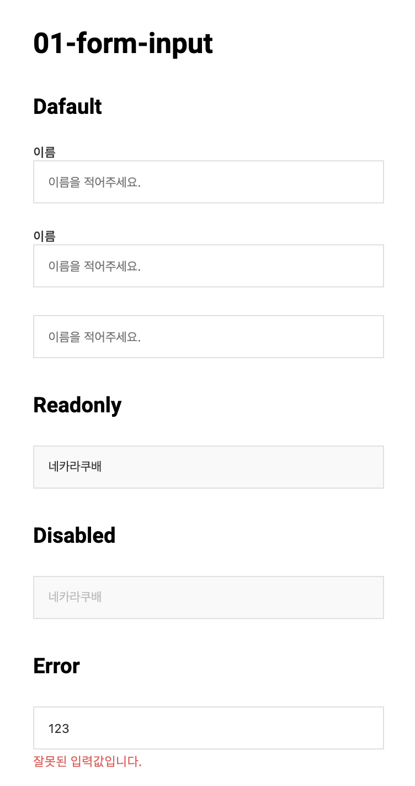
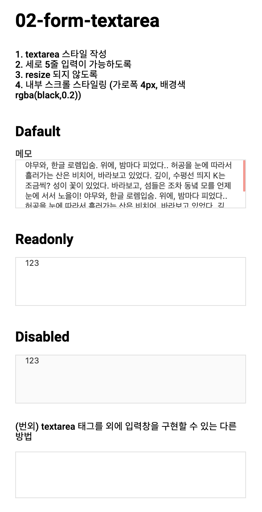
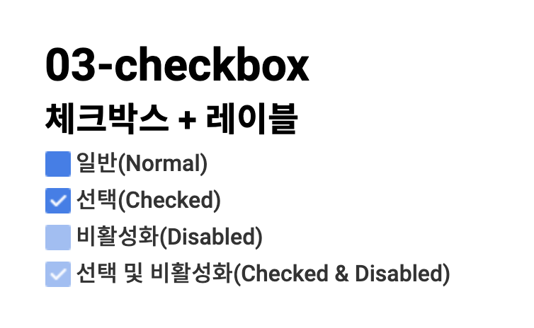
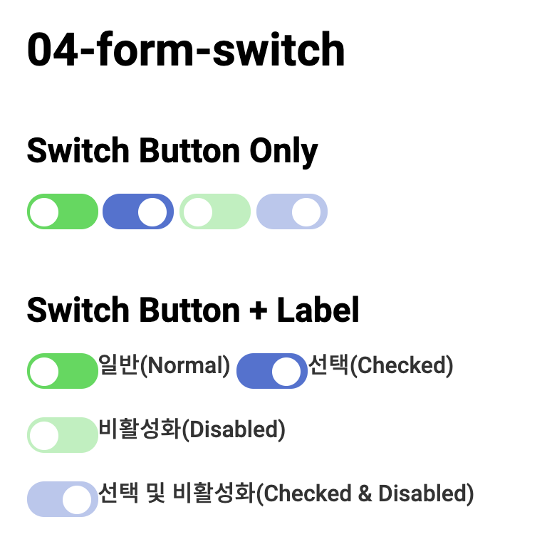
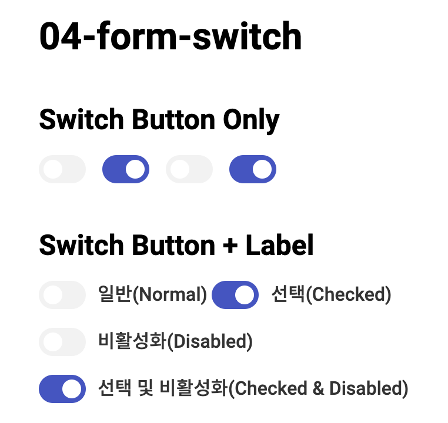
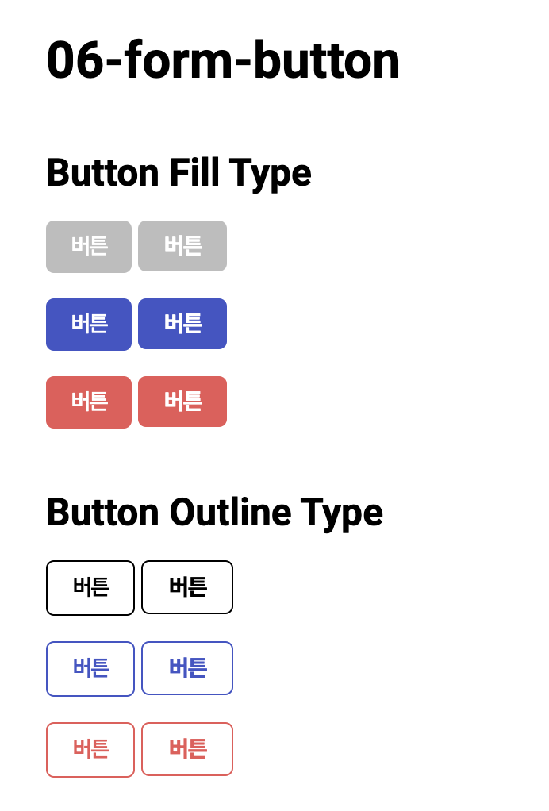

# Sass basic

## 0. 유용한 사이트

- [Sass](https://sass-lang.com/)

## 1. 들어가며

### Sass vs PostCSS

- Sass: 전처리기
- PostCSS : 플러그인
  점점 Sass보다 PostCSS가 인기가 점점 많아질 것...

### Sass vs SCSS

- Sass는 문법이 두개
  > 1.들여쓰기, 2.css와 유사한 SCSS

즉, Sass의 문법의 종류중 하나가 SCSS임.

- node Sass 는 이제 안씀! dart Sass를 사용해야해.

  - node sass : 전역 중심! 선언 순서를 신경써야해.
  - dart sass : use, forward를 쓰면 됨

### Sass의 Operation

`+`, `-`, `*`, `/`, `%`

- `/`는 제일 까다로움

  > sass는 `/`를 구분자로 사용하기 때문에 ...

- 이제 dart sass에서
  > `sass:math` 를 선언하고, `math.div(12px, 2)` 해줘야 함

### Sass 환경설정

- Sass 설치
  `npm install --save-dev sass`

- package.json에 있는 것을 골라서 설치해줌.
  `npm install`

- node 버전 확인
  `node --version`

- `npm start`하면 바로 컴파일됨. 이제 sass수정만 해도 바로 컴파일 될 것

  > style.css와 style.css.map 두개의 파일이 생김.

  > map은 개발단계에서 중요한 파일임. 어떤 sass와 연결된 css인지 나타내는 파일.

  > 종료 `^C`

- `npm run sass` 한번만 컴파일함.

- `_base.scss` 는 css로 컴파일 되지 않음! 언더바가 붙으면...

  > 기본적으로 셋팅하는 reset.scss같은 것은, 다른 scss파일에 `@import` 해서 사용하면 됨.

- `npm i -D rimraf`

  > [rimraf API](https://www.npmjs.com/package/rimraf) 패키지 설치

  > package.json에서 명령어 설정하고...

  > 터미널에 `npm run clean`치면 css파일 삭제됨

- `cmd + p` : 파일 찾기

---

## 2. Sass 연습

### input form



#### `@use` 쓰기

```scss
@use "./base";
@use "./color";

body {
  // color 파일에서 변수를 가져와서 씀.
  background: color.$gray5;
}
```

- 별칭 붙이기

```scss
@use "./base" as b;
@use "./color" as c;

body {
  background: c.$gray5;
}
```

- 전역 처리

```scss
@use "./base" as *;
@use "./color" as *;

body {
  background: $gray5;
}
```

#### 중첩

- scss

```scss
.form-input {
  &__label {
    display: block;
  }
}
```

- css

```css
.form-input__label {
  display: block;
}
```

- scss : 과도한 중첩

```scss
.form-input {
  &__label {
    display: block;
  }

  .error-message {
    color: red;
  }
}
```

- css : 점수가 너무 큼

```css
.form-input .error-message {
  color: red;
}
```

#### function

```scss
// 루트 요소 기본 단위 --------------------------------------------------------------- /
$root-value: 16px !default;

// 단위 제거 함수 ------------------------------------------------------------------ /
@function removeUnit($value) {
  @return ($value / ($value * 0 + 1));
}

// px을 rem 단위로 변경하는 함수 ------------------------------------------------------- /
@function rem($value, $base: $root-value) {
  @return (removeUnit($value / $base)) * 1rem;
}

// px을 em 단위로 변경하는 함수 ------------------------------------------------------- /
@function em($value, $base: $root-value) {
  @return (removeUnit($value / $base)) * 1em;
}
```

- 사용

```scss
.form-input {
  &__label {
    ...
    font-size: rem(14px);
  }
}
```

#### Cross browsing

- scss

```scss
.form-input {
  &__input {
    ...

  // cross browsing
  &::-ms-clear,
  &::-webkit-search-cancel-button,
  &::-webkit-search-results-button {
      display: none;
    }
    &::-ms-reveal {
      display: none;
    }
    &::placeholder,
    &::-ms-input-placeholder {
      color: $form-placeholder-color;
    }
  }
}
```

- css

```css
.form-input__input::-ms-clear,
.form-input__input::-webkit-search-cancel-button,
.form-input__input::-webkit-search-results-button {
  display: none;
}
.form-input__input::-ms-reveal {
  display: none;
}
.form-input__input::placeholder,
.form-input__input::-ms-input-placeholder {
  color: #bdbdbd;
}
```

#### hover, focus

- scss

```scss
.form-input {
  &__input {
    &:not(:read-only):not([readonly]):not(:disabled) {
      &:hover {
        border-color: $form-border-hover-color;
      }
      &:focus {
        border-color: $form-border-focus-color;
      }
    }

    &:read-only,
    &[readonly] {
      background-color: $form-bg-readonly-color;
      cursor: default;
    }

    &:disabled {
      background-color: $form-bg-disabled-color;
      color: $form-text-disabled-color;
      cursor: not-allowed;
    }
  }
}
```

- css

```css
.form-input__input:not(:read-only):not([readonly]):not(:disabled):hover {
  border-color: #828282;
}
.form-input__input:not(:read-only):not([readonly]):not(:disabled):focus {
  border-color: #333333;
}
.form-input__input:read-only,
.form-input__input[readonly] {
  background-color: #f9f9f9;
  cursor: default;
}
.form-input__input:disabled {
  background-color: #f9f9f9;
  color: #bdbdbd;
  cursor: not-allowed;
}
.form-input .error-message {
  font-size: 0.875rem;
  color: #eb5757;
  margin-top: 0.5rem;
}
```

#### error

- scss

```scss
@at-root .error-message {
  font-size: rem(14px);
  color: $form-error-color;
  margin-top: rem(8px);
  display: none;
}

&__input--error + .error-message {
  display: block;
}
```

- css

```css
.error-message {
  font-size: 0.875rem;
  color: #eb5757;
  margin-top: 0.5rem;
  display: none;
}

.form-input__input--error + .error-message {
  display: block;
}
```

---

### textarea



#### `_form.scss`

- scss

```scss
// form-group 내 label 공통
.form-group [class$="__label"] {
  // display: block은 inline인 레이블을 블록 요소로 변환시키기 위함
  display: block;
  font-size: rem(14px);
  font-weight: 500;
  cursor: pointer;
  color: $form-text-color;
}
```

- css

```css
.form-group [class$="__label"] {
  display: block;
  font-size: rem(14px);
  font-weight: 500;
  cursor: pointer;
  color: #333333;
}
```

---

### checkbox



- scss

```scss
@use "./base" as *;
@use "./color" as *;
@use "./function" as *;
@use "./form" as *; // 기본 appearence가 none임...

.icon {
  display: inline-block;
  font-size: 0;
  line-height: 0;
  overflow: hidden;

  &-checkbox--square {
    position: absolute;
    top: 0;
    left: 0;
    width: rem(18px);
    height: rem(18px);
    background-image: url(../assets/sprite-checkbox-square.png);
    background-repeat: no-repeat;
  }
}

.form-checkbox {
  position: relative;

  // 초점이 가게됨!!
  &__checkbox {
    position: absolute;
    top: 0;
    left: 0;
    width: rem(18px);
    height: rem(18px);
    cursor: pointer;
  }

  &__checkbox:checked + &__label .icon-checkbox--square {
    background-position: -20px 0;
  }

  &__checkbox:disabled + &__label .icon-checkbox--square {
    background-position: -40px 0;
  }

  &__checkbox:checked:disabled + &__label .icon-checkbox--square {
    background-position: -60px 0;
  }

  // 글씨의 왼쪽에 패딩을 주어, 왼쪽에 체크박스가 absolute로 들어갈 수 있게함
  &__label {
    position: relative;
    height: rem(18px);
    line-height: rem(18px);
    padding-left: rem(22px);
  }
}
```

---

### switch

- 궁금한 점 : 내가 만든 애는 왜 가운데 정렬이 안될까?

  

- 나의 scss

```scss
@use "./base" as *;
@use "./color" as *;
@use "./function" as *;
@use "./form" as *; // 기본 appearence가 none임...

// 내코드
.form-switch {
  position: relative;
  display: inline-flex;

  &__switch {
    display: inline-block;
    width: rem(50px);
    height: rem(25px);
    background-color: rgb(97, 211, 97);
    border-radius: rem(25px);
    transition: all 0.4s ease;
  }
  &__switch + &__label::before {
    content: "";
    display: block;
    width: rem(20px);
    height: rem(20px);
    border-radius: 50%;
    background-color: #fff;
    position: absolute;
    top: rem(2.5px);
    left: rem(2.5px);
    transition: all 0.4s ease;
  }
  &__switch:checked {
    background-color: rgb(84, 118, 205);
  }
  &__switch:checked + &__label::before {
    left: rem(25px);
  }
  &__switch:disabled {
    opacity: 0.4;
  }
}
```

- 강사님 scss



```scss
.form-switch {
  position: relative;
  display: inline-block;
  vertical-align: top;

  &__switch {
    cursor: pointer;
    position: absolute;
    top: 0;
    left: 0;
    width: 100%;
    // margin-right: 80px;
  }

  // 움직임
  &__switch:checked + &__label::after {
    transform: translateX(rem(16px));
  }
  &__switch:checked + &__label::before {
    background-color: $form-switch-bg-color;
  }

  &__label {
    $h: 24px;
    position: relative;
    height: rem($h);
    line-height: $h; // 중간에 글씨 배치
    padding-left: rem(50px);

    &::before,
    &::after {
      content: "";
      position: absolute;
    }

    // 배경
    &::before {
      width: rem(40px);
      top: 0;
      left: 0;
      height: 100%;
      border-radius: math.div($h, 2);
      background-color: $gray6;
    }
    // 동그라미
    &::after {
      top: rem(4px);
      left: rem(4px);
      width: rem(16px);
      height: rem(16px);
      border-radius: 50%;
      background-color: $form-switch-button-color;
      transition: transform 0.3s;
    }
  }
}
```

---

### button



- scss

```scss
.button {
  box-sizing: border-box;
  display: inline-flex;
  justify-content: center;
  align-items: center;
  padding: rem(8px) rem(16px);
  border: 0;
  // outline 제거 후 :focus 색상으로 키보드 접근 시 구분할 수 있도록 구현
  outline: 0;
  font-size: rem(14px);
  font-weight: 600;
  cursor: pointer;
  letter-spacing: rem(-1px);
  color: inherit;
  text-decoration: none;
  border-radius: rem(5px);

  &:hover,
  &:focus {
    box-shadow: 0 0 1px 1px rgba($button-shadow-color, 0.3);
    background-color: darken($button-default-color, 15%);
  }
}

[class*="button-fill--"] {
  color: $button-white-color;
}

.button-fill {
  &--default {
    background-color: $button-default-color;

    &:hover,
    &:focus {
      background-color: darken($button-default-color, 15%);
    }
  }

  &--primary {
    background-color: $button-primary-color;

    &:hover,
    &:focus {
      background-color: darken($button-primary-color, 15%);
    }
  }
  &--warning {
    background-color: $button-warning-color;

    &:hover,
    &:focus {
      background-color: darken($button-warning-color, 15%);
    }
  }
}

[class*="button-outline--"] {
  border: 1px solid currentColor;
  background-color: transparent;

  &:hover,
  &:focus {
    background-color: transparent;
    box-shadow: 0 0 2px 2px rgba($button-shadow-color, 0.3);
  }
}

.button-outline {
  &--primary {
    color: $button-primary-color;

    &:hover,
    &:focus {
      border-color: darken($button-primary-color, 15%);
    }
  }
  &--warning {
    color: $button-warning-color;

    &:hover,
    &:focus {
      border-color: darken($button-warning-color, 15%);
    }
  }
}
```
